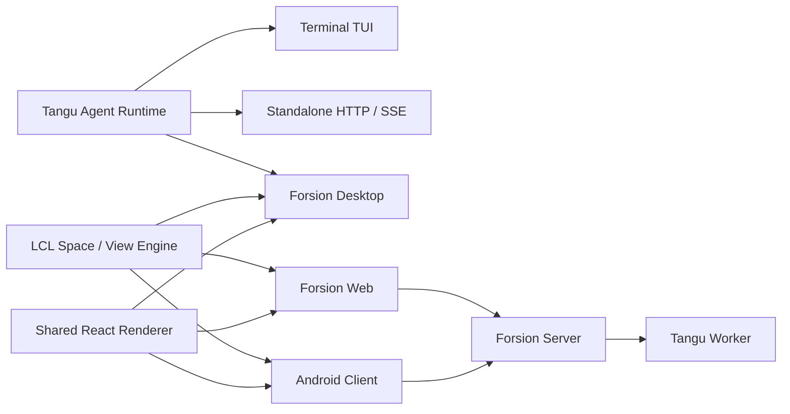

<div align="center">

# Forsion Genesis

**Your evolvable second-brain system.**

For ideas, knowledge, planning and vibe coding.<br>
A local-first, freely reshapable workbench where Agents and your work are truly connected.

**English** · [简体中文](./README.zh-CN.md)

[](https://github.com/Changan-Su/Forsion/releases)
[](https://github.com/Changan-Su/Forsion/actions/workflows/build-desktop.yml)


[](./LICENSE)

[Download & Install](#download--install) · [Core Capabilities](#core-capabilities) · [Local Development](#local-development) · [Architecture](#architecture) · [Contributing](#contributing)

</div>

---

## From a Single Thought to a System That Keeps Working

A thought might begin as a conversation, become a note, then a set of tasks, then a bit of code, and finally circle back into your calendar and inbox. Traditional software slices these steps into isolated apps; most AI products can only see the context inside the current chat box.

Forsion aims to do something different: **let knowledge, tools and Agents work continuously inside one shared environment.**

You can discuss an idea with Tangu, let it read material once authorized, organize it into Amadeus notes, write the dates into Calendar, generate a real project in Coding, then have Automation carry the follow-up work forward and deliver the results to your Inbox. Information no longer has to be copied back and forth between apps, and Agents no longer have to understand your world from scratch every time.

The system follows three principles:

- **Grow locally first, then choose how to sync.** Files, notes, sessions and configuration land on your device by default — easy for Agents to read, and easy for you to inspect, back up and protect. Forsion Cloud is an optional connective layer, not a prerequisite for using the local workbench.
- **From passive recording to active collaboration.** Memory, tasks and tools are not merely saved; once you explicitly configure and authorize them, Agents and automation can keep organizing information, driving tasks forward and delivering results.
- **Instead of adapting to fixed software, shape your own workflow.** Spaces define the context you're working in right now, Views and layouts decide how information appears, and plugins, skills and Agents let the workbench gradually grow into something that fits you.

That is what Forsion means by a "second brain": not another information silo, but a personal system you own — one that understands context and helps you act.

## What Is Forsion

Forsion is more than an AI chat client. It treats the AI Agent as a foundational capability of the workbench, so conversations can work alongside real files, notes, projects, schedules and automation tasks.

**Forsion Genesis** is the unified source repository for the Forsion product family. It contains:

- The interface-agnostic **Tangu Agent runtime**, which can run in a terminal, a headless service or a desktop app;
- The **LCL workspace engine** built on the Space / View / Plugin model;
- **Forsion Desktop** for everyday use;
- Web and Android clients that reuse the same rendering layer;
- Standalone distributions such as the full-featured Forsion build and Amadeus, tailored from product profiles.

### One Engine, Many Product Forms

- **AI is part of the workflow**: within the scope you authorize, Agents can read projects, edit files, run tools, and use skills and MCP — rather than staying stuck in a chat window.
- **Local-first, not local-only**: workspaces, sessions, skills and settings are stored on your machine by default; you can also connect local models, your own APIs, subscription accounts or Forsion Cloud as needed.
- **One workbench, many working contexts**: conversation, notes, calendar, coding and automation are organized into switchable Spaces that share files, search, layout and context.
- **The interface can be recomposed**: panels support drag-and-drop, split views, stacking, standalone windows, layout memory and custom Spaces — suitable for everything from lightweight capture to complex projects.
- **One core, many runtimes**: desktop, TUI, HTTP service, Web and mobile share the same core contracts, reducing feature drift and making self-hosting and extension easier.
- **Driven by product profiles**: the same source can combine different Spaces, branding and backend capabilities to build a complete workbench or a product focused on a single scenario.

## Core Capabilities

### Six Built-in Spaces

| Space | Purpose |
| --- | --- |
| **Tangu** | AI conversation and task execution; supports sessions, project files, memory, skills, sub-tasks, multi-Agent, and connecting external Agent engines such as Claude Code and Codex. |
| **Amadeus** | Local knowledge base; supports Markdown, bidirectional links, backlinks, graph view, tags, full-text search, databases, attachments and PDF. |
| **Calendar** | Aggregates dates and to-dos from Amadeus databases, providing calendar, time-window, filter and cross-base task views. |
| **Inbox** | A central place for local messages, system notifications and Forsion service messages, with unread state and reminders. |
| **Coding** | Puts requirement conversations, code editing, project files and live preview in one workspace — ideal for quickly building web prototypes. |
| **Automation** | Configure scheduled tasks and watch rules, and review the execution records and results of unattended Agents. |

### Agents & Models

- Supports OpenAI-compatible endpoints, local Ollama, Forsion-hosted models, and supported subscription-account login methods.
- Supports tool-approval tiers, file-access boundaries, command execution, background tasks, browser tools, image tools and a Docker Python sandbox.
- Supports MCP, editable skills, folder-based Agents, long-term memory, group chat, sub-task delegation and appending instructions mid-run.
- Can connect installed external Agent CLIs such as Claude Code and Codex via ACP, routing their permission requests uniformly through Forsion.

> Forsion itself does not change the data policies of upstream model services. When you use cloud models, the relevant requests are sent to the provider you chose; when you use local models and local capabilities, you can keep the data on your own device.

### Local Knowledge & Workspace

- Notes and attachments are saved directly in a local Vault, readable and backable by other file tools.
- Databases support table, board, calendar and gallery views, with configurable filters, sorting, relations and rollups.
- Global quick-find jumps to notes, databases and chat sessions.
- The workspace supports left/right sidebars, tabs, arbitrary splits, cross-window drag-and-drop, floating Mini cards and layout restoration.
- Custom themes, skills, Agents, plugins and Spaces are all installed as local files, easy to inspect, modify and version-control.

## Download & Install

### Install the Desktop App

Head to [GitHub Releases](https://github.com/Changan-Su/Forsion/releases) to download the latest version.

| Platform | Current release artifact | Notes |
| --- | --- | --- |
| macOS | `Forsion-*.dmg` | Currently auto-builds the Apple Silicon (arm64) version. |
| Windows | `Forsion-*.exe` | NSIS installer. |
| Linux | `Forsion-*.AppImage` | Add execute permission after downloading, then run. |

The first launch walks you through connection method, model, theme, workspace and a local environment check. The desktop install bundles the Agent backend and everything needed to run — no need to install Node.js beforehand.

> **A note on installer signing**: the macOS build currently uses ad-hoc signing and has not yet been notarized by Apple; the Windows build may also trigger SmartScreen. Only download from this repository's Releases. If Gatekeeper blocks the first open on macOS, right-click the app and choose "Open", or allow it under "System Settings → Privacy & Security".

### Where Your Data Lives

The official desktop build uses, by default:

| Path | Contents |
| --- | --- |
| `~/.forsion/` | Account, settings, Agent data, sessions, skills, plugins and local databases. |
| `~/Forsion/` | User-visible workspace, knowledge base and project files. |

The dev build uses separate `~/.forsion-dev/` and `~/Forsion-Dev/` so it won't pollute production data. Legacy `~/.tangu` / `~/Tangu` data is migrated by the desktop app, which keeps a compatibility entry point.

Back up these two directories regularly, just like ordinary documents. Before running high-privilege Agent tasks, confirm the approval tier and the current working directory.

## Local Development

### Requirements

- Node.js 20 or newer;
- npm and Git;
- The native build toolchain for your target platform when building installers;
- JDK 17 and the Android SDK additionally for Android builds;
- Docker only when using the Python sandbox or container deployment.

### Run the Desktop App in Dev

```bash
git clone https://github.com/Changan-Su/Forsion.git
cd Forsion

# Build the Agent backend embedded in the desktop app first
cd tangu-agent
npm ci
npm run build

# Then start the Electron desktop app
cd ../desktop
npm ci
npm run dev
```

The `desktop` `postinstall` automatically sets up the LCL dependency links. Keep the existing directory relationships from the repository root — do not copy `desktop/` or `lcl/` on their own.

Common commands:

| Directory | Command | Purpose |
| --- | --- | --- |
| `tangu-agent/` | `npm run build` | Compile the Agent runtime. |
| `tangu-agent/` | `npm run typecheck` | Check types and plugin-API sync status. |
| `tangu-agent/` | `npm test` | Run the runtime tests. |
| `desktop/` | `npm run dev` | Start the desktop dev environment. |
| `desktop/` | `npm run typecheck` | Check desktop types. |
| `desktop/` | `npm test` | Run desktop unit tests. |
| `desktop/` | `npm run build` | Build the Electron main process, preload and renderer. |
| `desktop/` | `npm run dist` | Produce an installer for the current platform. |
| `desktop/` | `npm run e2e:editor` | Run the Amadeus editor end-to-end tests. |

### Run the TUI or Headless Service

```bash
cd tangu-agent
npm ci
npm run build

# Optional: copy and edit local config
mkdir -p ~/.tangu
cp example.env ~/.tangu/.env

npm run tui       # Terminal interface
npm run server    # HTTP / SSE service, default 127.0.0.1:8787
```

`example.env` shows how to configure local models, OpenAI-compatible providers, Forsion Cloud, databases, the sandbox and the worker. Never commit real tokens or API keys to the repository.

### Build Other Product Profiles

The default profile is Forsion, with all six Spaces. The repository also provides an Amadeus profile that does not bundle the Agent backend or the app marketplace:

```bash
cd desktop
npm run dev:amadeus
npm run build:amadeus
npm run pack:amadeus
```

When adding a new product, define its product identity, default Spaces, feature set and backend capabilities in `desktop/products/`, and add profile tests.

## Web & Deployment

### Web Local Development

Forsion Web reuses the desktop rendering layer and connects to a running Forsion Server. The default dev address is `http://localhost:5273`, with the backend proxy target at `http://localhost:3001`.

```bash
cd web
cp .env.example .env
npm ci
npm run dev
```

### Web Container Deployment

The Docker build context must be the repository root, because Web reads source from `desktop/frontend`, `desktop/shared` and `lcl`.

```bash
BACKEND_URL=http://host.docker.internal:3001 \
  docker compose -f web/docker-compose.yml up -d --build
```

The site is published to host port `8090` by default. See [web/README.md](./web/README.md) for full reverse-proxy, environment-variable, HTTPS and troubleshooting notes.

### Android

The mobile client is primarily Android / Capacitor, reusing the desktop rendering layer with a single-column interface. It is currently better suited for development and validating mobile workflows than as a full replacement for the desktop app. See [mobile/README.md](./mobile/README.md) for build steps and deep-link login requirements.

## Architecture



The Tangu Agent isolates storage, models, billing and runtime environment through the `host`, `brain`, `billing` and `profile` seams; LCL splits interface capabilities into registrable Spaces and Views. Combined, the same business capability can be reused across the local desktop, self-hosted services and cloud-connected clients.

### Repository Structure

```text
Forsion/
├── tangu-agent/   # Agent runtime, TUI, standalone, tools, skills & plugin API
├── lcl/           # Space / View / Plugin workspace engine
├── desktop/       # Electron main process, shared React renderer & product profiles
├── web/           # Vite + nginx browser client
├── mobile/        # Capacitor Android client
├── archived/      # Read-only historical implementations
└── Dockerfile.standalone
```

### Client Status

| Form | Role | Status |
| --- | --- | --- |
| Desktop | The full Forsion workbench for everyday use | Primary release target |
| TUI / Standalone | Terminal use, scripting integration and local service | Available, maintained alongside the runtime |
| Web | A standalone web client connected to Forsion Server | Self-hostable, depends on the server |
| Mobile | Android cloud connection and mobile workflows | Under active development |

## Testing & Release

Before committing, at least run the type checks and tests relevant to your changes:

```bash
cd tangu-agent
npm run typecheck
npm test

cd ../desktop
npm run typecheck
npm test
```

The release workflow is triggered by `v*` tags: it first checks Tangu Agent types and tests, then builds installers on macOS, Windows and Linux runners respectively, and finally creates or updates the GitHub Release. You can also run the build manually from the Actions page and download the Artifacts.

User-visible desktop changes should be recorded in [desktop/CHANGELOG.md](./desktop/CHANGELOG.md).

## Contributing

Issues and Pull Requests are welcome. To make problems easier to reproduce and merge:

1. When filing a bug, include the Forsion version, operating system, reproduction steps, expected behavior and any necessary logs;
2. Search existing issues before development, and keep each Pull Request focused on one clear problem;
3. Do not commit `.env`, tokens, local databases, workspace content or build artifacts;
4. Behavior changes need added or updated tests, and user-visible changes need a Changelog update;
5. When modifying the shared rendering layer, consider the capability differences and runtime gating across Desktop, Web and Mobile.

You can view or file issues from [Issues](https://github.com/Changan-Su/Forsion/issues), or open a Pull Request directly to help improve the project.

## License

Forsion Genesis uses the [Modified Apache License 2.0](./LICENSE). It is based on Apache License 2.0 with additional conditions, mainly covering:

- You may not use this repository's code to operate a multi-tenant environment without written authorization;
- When using the `desktop/`, `web/` or `mobile/` frontends, you may not remove or modify the logo, product name and copyright notices in the interface;
- Commercial use is permitted when the additional conditions are met; a commercial license should be obtained for multi-tenant deployment or other authorizations.

Please read the full license text before using, distributing or offering services based on this project. This license includes restrictions beyond Apache-2.0, so it should not be understood as the standard Apache-2.0 license alone.

---

<div align="center">

**Forsion Genesis — bring Agents into your workflow, not just into a chat box.**

</div>
