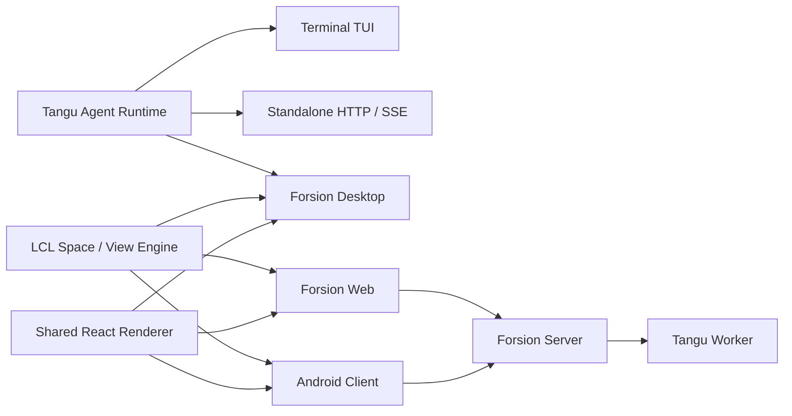

<div align="center">

# Forsion Genesis

**你的可进化第二大脑系统。**

用于想法、知识、计划与 Vibe Coding。<br>
在一个本地优先、可以由你自由塑造的工作台里，让 Agent 与你的工作真正连接起来。

[](https://github.com/Changan-Su/Forsion/releases)
[](https://github.com/Changan-Su/Forsion/actions/workflows/build-desktop.yml)


[](./LICENSE)

[下载与安装](#下载与安装) · [核心能力](#核心能力) · [本地开发](#本地开发) · [架构](#架构) · [参与贡献](#参与贡献)

</div>

---

## 从一个念头，到一套能持续工作的系统

一个念头可能从对话开始，变成一篇笔记、一组任务、一段代码，最后又回到日历和收件箱里。传统软件把这些过程切成许多孤立的应用；多数 AI 产品也只能看见当前聊天框里的上下文。

Forsion 想做的是另一件事：**让知识、工具和 Agent 在同一个工作环境里连续工作。**

你可以和 Tangu 讨论一个想法，让它在授权后读取资料、整理成 Amadeus 笔记、把日期写进 Calendar、在 Coding 中生成真实项目，再由 Automation 继续执行后续任务，并把结果送到 Inbox。信息不必在多个应用间反复复制，Agent 也不必每次从零理解你的世界。

这套系统遵循三个原则：

- **先在本地生长，再选择如何同步。** 文件、笔记、会话与配置默认落在你的设备上，便于 Agent 读取，也便于你检查、备份和保护；Forsion Cloud 是可选的连接层，不是使用本地工作台的前提。
- **从被动记录，走向主动协作。** 记忆、任务和工具不只是被保存下来；在你明确配置和授权后，Agent 与自动化可以继续整理信息、推进任务并交付结果。
- **不是适应固定软件，而是塑造自己的工作流。** Space 决定你此刻工作的语境，View 与布局决定信息如何出现，插件、技能和 Agent 则让这套工作台逐渐长成适合你的样子。

这就是 Forsion 所说的“第二大脑”：它不是另一个信息仓库，而是一套由你拥有、能够理解上下文并帮助你行动的个人系统。

## Forsion 是什么

Forsion 不只是一个 AI 对话客户端。它把 AI Agent 作为工作台中的一项基础能力，让对话可以和真实的文件、笔记、项目、日程及自动化任务共同工作。

**Forsion Genesis** 是 Forsion 产品家族的统一源码仓。仓库包含：

- 与界面无关的 **Tangu Agent 运行时**，可运行在终端、无头服务或桌面应用中；
- 基于 Space / View / Plugin 模型的 **LCL 工作区引擎**；
- 面向日常使用的 **Forsion Desktop**；
- 复用同一渲染层的 Web 与 Android 客户端；
- 由产品档案裁剪出的 Forsion 全功能版与 Amadeus 等独立发行版。

### 一套引擎，多种产品形态

- **AI 是工作流的一部分**：Agent 可以在授权范围内读取项目、编辑文件、运行工具、使用技能与 MCP，而不是停留在聊天窗口里。
- **本地优先，而不是本地限定**：工作区、会话、技能和设置默认保存在本机；你也可以按需连接本地模型、自己的 API、订阅账号或 Forsion 云端。
- **一个工作台，多种工作语境**：对话、笔记、日历、编码和自动化被组织为可切换的 Space，并共享文件、搜索、布局和上下文。
- **界面可以重新组合**：面板支持拖拽、分屏、堆叠、独立窗口、布局记忆和自定义 Space，适合从轻量记录到复杂项目的不同工作方式。
- **同一套核心，多种运行形态**：桌面、TUI、HTTP 服务、Web 和移动端共用核心契约，减少功能分叉，也便于自托管和二次开发。
- **产品档案驱动**：同一源码可以组合不同 Space、品牌和后端能力，构建完整工作台或聚焦单一场景的产品。

## 核心能力

### 六个内置 Space

| Space | 用途 |
| --- | --- |
| **Tangu** | AI 对话与任务执行；支持会话、项目文件、记忆、技能、子任务、多 Agent，以及 Claude Code、Codex 等外部 Agent 引擎接入。 |
| **Amadeus** | 本地知识库；支持 Markdown、双向链接、反向链接、关系图、标签、全文搜索、多维表、附件与 PDF。 |
| **Calendar** | 聚合 Amadeus 数据库中的日期与待办信息，提供日历、时间窗口、筛选和跨库任务视图。 |
| **Inbox** | 集中处理本地消息、系统通知与 Forsion 服务消息，并支持未读状态和提醒。 |
| **Coding** | 将需求对话、代码编辑、项目文件和实时预览放在同一工作区，适合快速构建 Web 原型。 |
| **Automation** | 配置定时任务与监控规则，查看无人值守 Agent 的执行记录和结果。 |

### Agent 与模型

- 支持 OpenAI 兼容接口、本地 Ollama、Forsion 托管模型，以及支持的订阅账号登录方式。
- 支持工具审批档位、文件访问边界、命令执行、后台任务、浏览器工具、图像工具和 Docker Python 沙箱。
- 支持 MCP、可编辑技能、文件夹化 Agent、长期记忆、群聊、子任务委派与运行中追加指令。
- 可通过 ACP 接入已安装的 Claude Code、Codex 等外部 Agent CLI，并将权限请求统一交给 Forsion。

> Forsion 本身不改变上游模型服务的数据政策。使用云端模型时，相关请求会发送给你选择的服务商；使用本地模型和本地能力时，可将数据保留在自己的设备上。

### 本地知识与工作区

- 笔记与附件直接保存在本地 Vault 中，可被其他文件工具读取和备份。
- 多维表支持表格、看板、日历和画廊视图，并可配置筛选、排序、关联与统计。
- 全局快速查找可跳转到笔记、数据库和聊天会话。
- 工作区支持左右侧栏、标签页、任意分栏、跨窗口拖拽、Mini 悬浮卡片和布局恢复。
- 自定义主题、技能、Agent、插件和 Space 都以本地文件形式安装，便于检查、修改和版本管理。

## 下载与安装

### 安装桌面版

前往 [GitHub Releases](https://github.com/Changan-Su/Forsion/releases) 下载最新版本。

| 平台 | 当前发布产物 | 说明 |
| --- | --- | --- |
| macOS | `Forsion-*.dmg` | 当前自动构建 Apple Silicon（arm64）版本。 |
| Windows | `Forsion-*.exe` | NSIS 安装程序。 |
| Linux | `Forsion-*.AppImage` | 下载后添加执行权限即可运行。 |

首次启动会引导你完成连接方式、模型、主题、工作区和本地环境检查。桌面安装版包含 Agent 后端与运行所需组件，不需要预先安装 Node.js。

> **安装包签名说明**：macOS 构建目前使用 ad-hoc 签名，尚未经过 Apple 公证；Windows 构建也可能触发 SmartScreen。请只从本仓库 Releases 下载。macOS 首次打开若被 Gatekeeper 拦截，可右键应用选择“打开”，或在“系统设置 → 隐私与安全性”中允许打开。

### 数据存放位置

正式桌面版默认使用：

| 路径 | 内容 |
| --- | --- |
| `~/.forsion/` | 账号、设置、Agent 数据、会话、技能、插件与本地数据库。 |
| `~/Forsion/` | 用户可见的工作区、知识库和项目文件。 |

开发版使用独立的 `~/.forsion-dev/` 与 `~/Forsion-Dev/`，不会污染正式版数据。旧版 `~/.tangu` / `~/Tangu` 数据会由桌面端迁移并保留兼容入口。

建议像备份普通文档一样定期备份这两个目录。执行高权限 Agent 任务前，请确认审批档位与当前工作目录。

## 本地开发

### 环境要求

- Node.js 20 或更高版本；
- npm 与 Git；
- 构建安装包时，需要目标平台的原生编译工具链；
- Android 构建额外需要 JDK 17 与 Android SDK；
- Docker 仅在使用 Python 沙箱或容器部署时需要。

### 启动桌面开发版

```bash
git clone https://github.com/Changan-Su/Forsion.git
cd Forsion

# 先构建桌面端内嵌的 Agent 后端
cd tangu-agent
npm ci
npm run build

# 再启动 Electron 桌面端
cd ../desktop
npm ci
npm run dev
```

`desktop` 的 `postinstall` 会自动建立 LCL 依赖链接。请从仓库根目录保持现有目录关系，不要单独复制 `desktop/` 或 `lcl/`。

常用命令：

| 目录 | 命令 | 用途 |
| --- | --- | --- |
| `tangu-agent/` | `npm run build` | 编译 Agent 运行时。 |
| `tangu-agent/` | `npm run typecheck` | 检查类型与插件 API 同步状态。 |
| `tangu-agent/` | `npm test` | 运行运行时测试。 |
| `desktop/` | `npm run dev` | 启动桌面开发环境。 |
| `desktop/` | `npm run typecheck` | 检查桌面端类型。 |
| `desktop/` | `npm test` | 运行桌面端单元测试。 |
| `desktop/` | `npm run build` | 构建 Electron 主进程、preload 与渲染层。 |
| `desktop/` | `npm run dist` | 为当前平台生成安装包。 |
| `desktop/` | `npm run e2e:editor` | 运行 Amadeus 编辑器端到端测试。 |

### 运行 TUI 或无头服务

```bash
cd tangu-agent
npm ci
npm run build

# 可选：复制并编辑本地配置
mkdir -p ~/.tangu
cp example.env ~/.tangu/.env

npm run tui       # 终端界面
npm run server    # HTTP / SSE 服务，默认 127.0.0.1:8787
```

`example.env` 展示了本地模型、OpenAI 兼容 Provider、Forsion 云端、数据库、沙箱和 worker 的配置方式。不要将真实 Token 或 API Key 提交到仓库。

### 构建其他产品档案

默认档案是包含六个 Space 的 Forsion。仓库还提供不捆绑 Agent 后端和应用市场的 Amadeus 档案：

```bash
cd desktop
npm run dev:amadeus
npm run build:amadeus
npm run pack:amadeus
```

新增产品时，在 `desktop/products/` 中定义产品身份、默认 Space、功能集合和后端能力，并补充档案测试。

## Web 与服务部署

### Web 本地开发

Forsion Web 复用桌面渲染层，并连接一个正在运行的 Forsion Server。默认开发地址是 `http://localhost:5273`，后端代理目标是 `http://localhost:3001`。

```bash
cd web
cp .env.example .env
npm ci
npm run dev
```

### Web 容器部署

Docker 构建上下文必须是仓库根目录，因为 Web 会读取 `desktop/frontend`、`desktop/shared` 和 `lcl` 的源码。

```bash
BACKEND_URL=http://host.docker.internal:3001 \
  docker compose -f web/docker-compose.yml up -d --build
```

站点默认发布到宿主机 `8090` 端口。完整的反向代理、环境变量、HTTPS 与排障说明见 [web/README.md](./web/README.md)。

### Android

移动端以 Android / Capacitor 为主，复用桌面渲染层并替换为单列界面。目前它更适合参与开发和验证移动工作流，而不是作为桌面版的完整替代品。构建步骤与深链登录要求见 [mobile/README.md](./mobile/README.md)。

## 架构



Tangu Agent 通过 `host`、`brain`、`billing` 与 `profile` 接缝隔离存储、模型、计费和运行环境；LCL 则把界面能力拆成可注册的 Space 与 View。两者结合后，同一套业务能力可以在本地桌面、自托管服务和云连接客户端之间复用。

### 仓库结构

```text
Forsion/
├── tangu-agent/   # Agent 运行时、TUI、standalone、工具、技能与插件 API
├── lcl/           # Space / View / Plugin 工作区引擎
├── desktop/       # Electron 主进程、共享 React 渲染层与产品档案
├── web/           # Vite + nginx 的浏览器客户端
├── mobile/        # Capacitor Android 客户端
├── archived/      # 只读历史实现
└── Dockerfile.standalone
```

### 各端状态

| 形态 | 定位 | 状态 |
| --- | --- | --- |
| Desktop | 日常使用的完整 Forsion 工作台 | 主要发布目标 |
| TUI / Standalone | 终端使用、脚本集成与本地服务 | 可用，随运行时共同维护 |
| Web | 连接 Forsion Server 的独立 Web 客户端 | 可自托管，依赖服务端 |
| Mobile | Android 云连接与移动工作流 | 持续开发中 |

## 测试与发布

提交前至少运行与你改动相关的类型检查和测试：

```bash
cd tangu-agent
npm run typecheck
npm test

cd ../desktop
npm run typecheck
npm test
```

发布工作流由 `v*` 标签触发：先检查 Tangu Agent 类型与测试，再分别在 macOS、Windows 和 Linux Runner 构建安装包，最后创建或更新 GitHub Release。也可以在 Actions 页面手动运行构建并下载 Artifacts。

用户可见的桌面变化应同步写入 [desktop/CHANGELOG.md](./desktop/CHANGELOG.md)。

## 参与贡献

欢迎提交 Issue 和 Pull Request。为了让问题更容易复现和合并：

1. 提交 Bug 时，请包含 Forsion 版本、操作系统、复现步骤、预期行为和必要日志；
2. 开发前先搜索已有 Issue，并将一次 Pull Request 聚焦在一个明确问题上；
3. 不要提交 `.env`、Token、本地数据库、工作区内容或构建产物；
4. 行为变更需要补充或更新测试，用户可见变化需要更新 Changelog；
5. 修改共享渲染层时，请同时考虑 Desktop、Web 和 Mobile 的能力差异与运行时门控。

你可以从 [Issues](https://github.com/Changan-Su/Forsion/issues) 查看或提交问题，也欢迎直接发起 Pull Request 参与改进。

## 许可

Forsion Genesis 使用 [Modified Apache License 2.0](./LICENSE)。它以 Apache License 2.0 为基础，并包含额外条件，主要涉及：

- 未经书面授权，不得使用本仓库代码运营多租户环境；
- 使用 `desktop/`、`web/` 或 `mobile/` 前端时，不得移除或修改界面中的 Logo、产品名称与版权信息；
- 符合附加条件时可以商业使用；需要多租户部署或其他授权时，应取得商业许可。

请在使用、分发或基于本项目提供服务前阅读完整许可文本。该许可包含 Apache-2.0 之外的限制，因此不应仅按标准 Apache-2.0 许可理解。

---

<div align="center">

**Forsion Genesis — 让 Agent 进入工作流，而不只是进入聊天框。**

</div>
